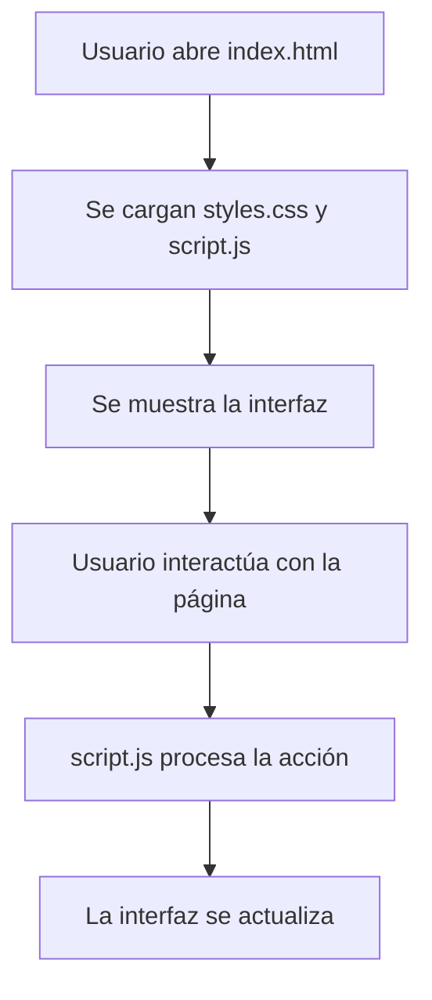

# repo_paga_todo
# repo_paga_todo

Este proyecto es una página web sencilla que permite a los usuarios interactuar con una interfaz amigable. El objetivo principal es mostrar cómo se conectan los diferentes componentes de una web básica y cómo se puede personalizar fácilmente.

## Estructura del proyecto

- **index.html**: Define la estructura principal de la página, incluyendo los elementos visuales y los puntos de interacción.
- **styles.css**: Contiene los estilos que determinan la apariencia visual, colores, fuentes y disposición de los elementos.
- **script.js**: Implementa la lógica y funcionalidad, permitiendo la interacción dinámica del usuario con la página.

## Funcionamiento general

Al abrir `index.html` en el navegador, se cargan automáticamente los estilos y scripts. El usuario puede interactuar con los elementos de la página, y las acciones se procesan mediante JavaScript para actualizar la interfaz en tiempo real.

### Diagrama de funcionamiento

## Cómo usar

1. Descarga o clona el repositorio.
2. Abre el archivo `index.html` en tu navegador preferido.
3. Interactúa con la página y observa cómo responde a tus acciones.

## Personalización

- Modifica `styles.css` para cambiar el diseño, colores o fuentes según tus preferencias.
- Edita `script.js` para agregar nuevas funcionalidades o modificar el comportamiento existente.

## Recomendaciones

- Mantén una estructura clara en el HTML para facilitar futuras modificaciones.
- Utiliza comentarios en el código para explicar partes importantes.
- Prueba la página en diferentes navegadores para asegurar compatibilidad.
